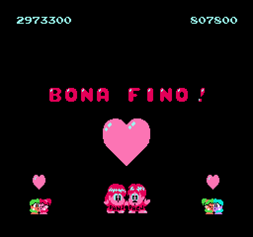

# Bubble Bobble

_Legu
[bubblebobble-readme.txt](bubblebobble-readme.txt) por esperanta
priskrbo._

This project is a fan translation of
[Bubble Bobble](https://en.wikipedia.org/wiki/Bubble_Bobble), a
video game for the Nintendo Entertainment System, to Esperanto.
All copyrights on the original game belong to Nintendo.

You *must* own a physical copy of the Bubble Bobble cartridge.
Downloading the ROM of any game which you do not own may be
considered piracy.

  * Bubble Bobble (USA) - CRC32 `5E900522`

## Screenshots

Here are some pretty screenshots:

